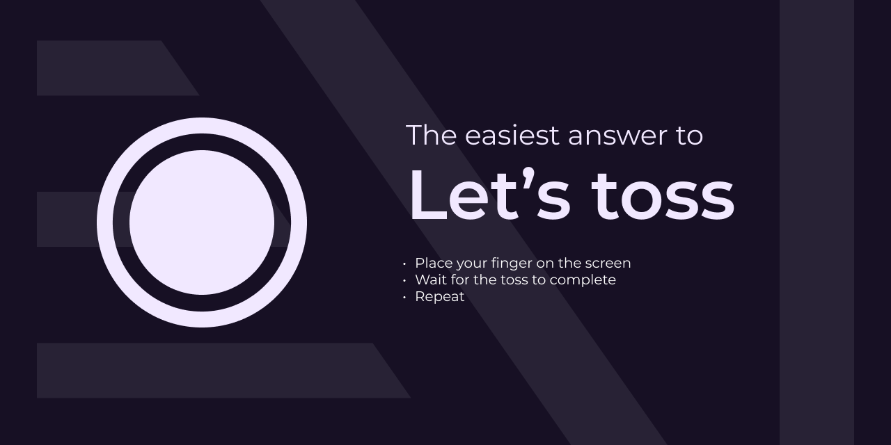

# Let's toss

An interactive web app that lets users place fingers on the screen and randomly selects one for quick and fair decisions.

## Features

- Easy to use: Simply place your finger on the screen and let the app do the rest.
- Random selection: The app uses a random algorithm (`Math.random()`  😜) to ensure fair and unbiased results.
- Quick decisions: Get instant results without any delays.
- Web-based: Access the app from any device with a web browser.

## Getting Started

To get started with the Toss App, follow these steps:

1. Visit the app's website at [https://lets-toss.vercel.app](https://lets-toss.vercel.app).
2. Place your finger on the screen.
3. Wait for the app to randomly select a finger.
4. Receive the result and make your decision based on it.

## Usage

The Toss App can be used in various scenarios, including:

- Settling disputes: Use the app to determine who goes first or who gets the last slice of pizza.
- Decision-making: Let the app make the tough choices for you, such as picking a restaurant or deciding on a movie to watch.
- Random selection: Need to randomly select a winner for a giveaway or a raffle? The Toss App has got you covered.

## Contributing

Contributions are welcome! If you have any ideas, suggestions, or bug reports, please open an issue on the [GitHub repository](https://github.com/deepak-kharah/lets-toss).

## License

This project is licensed under the [MIT License](LICENSE).
